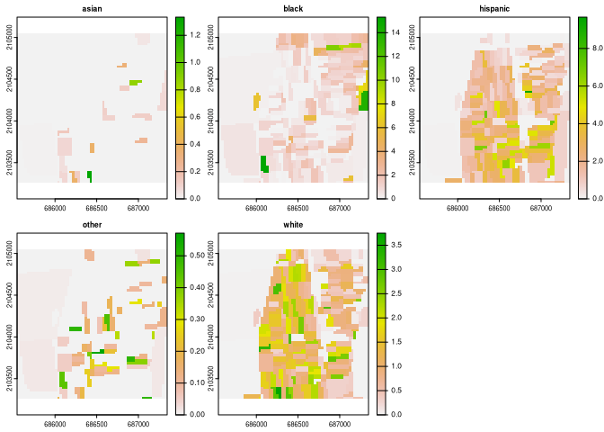

<!-- README.md is generated from README.Rmd. Please edit that file -->

# raceland

<!-- badges: start -->

[](https://travis-ci.org/Nowosad/raceland)
[](https://codecov.io/gh/Nowosad/raceland?branch=master)
<!-- badges: end -->

Raceland package implements a computational framework for a
pattern-based, zoneless analysis, and visualization of (ethno)racial
topography. It is a reimagined approach for analyzing residential
segregation and racial diversity based on the concept of ‘landscape’
used in the domain of landscape ecology. A racial landscape, represented
by a high-resolution raster grid with each cell containing only
inhabitants of a single race, is quantified by two metrics (entropy and
mutual information) derived from Information Theory concept (IT).
Entropy is the measure of racial diversity and mutual information
measures racial segregation.

Racial landscape method is based on the raster gridded data, and unlike
the previous methods, does not depend on the division of specific zones
(census tract, census block, etc.). Calculation of racial diversity
(entropy) and racial segregation (mutual information) can be performed
for the whole area of interests (i.e., metropolitan area) without
introducing any arbitrary divisions. Racial landscape method also allows
for performing calculations at different spatial
scales.

## Installation

<!-- You can install the released version of raceland from [CRAN](https://CRAN.R-project.org) with: -->

<!-- ``` r -->

<!-- install.packages("raceland") -->

<!-- ``` -->

You can install the development version from
[GitHub](https://github.com/) with:

``` r
# install.packages("devtools")
devtools::install_github("Nowosad/raceland")
```

## Example

``` r
library(raceland)
library(raster)
#> Loading required package: sp
```

``` r
# Plot the input data
data(race_raster, package = "raceland")
plot(race_raster)
```



``` r
# Construct racial landscape
real_raster = create_realizations(x = race_raster, n = 100)
race_colors = c("#F16667", "#6EBE44", "#7E69AF", "#C77213","#F8DF1D")
plot(real_raster, col = race_colors, maxnl = 9)
```


``` r
# Plot racial ladnscape 
plot_realization(x = real_raster[[1]], y = race_raster, hex = race_colors)
```


``` r
# Calculate local subpopulation densities
dens_raster = create_densities(real_raster, race_raster, window_size = 10)
plot(dens_raster, maxnl = 9)
```


``` r
# Calculate IT-metrics 
metr_df = calculate_metrics(x = real_raster, w = dens_raster,
                            neighbourhood = 4, fun = "mean", 
                            size = NULL, threshold = 1)
head(metr_df)
#>   realization row col      ent  joinent  condent    mutinf
#> 1           1   1   1 1.634242 3.154323 1.520082 0.1141598
#> 2           2   1   1 1.633990 3.155930 1.521940 0.1120499
#> 3           3   1   1 1.642078 3.178563 1.536485 0.1055935
#> 4           4   1   1 1.635785 3.168928 1.533143 0.1026423
#> 5           5   1   1 1.646446 3.172136 1.525690 0.1207565
#> 6           6   1   1 1.641480 3.157474 1.515995 0.1254850
```

``` r
# Summarize IT metrics 
summary(metr_df[, c("ent", "mutinf")])
#>       ent            mutinf       
#>  Min.   :1.607   Min.   :0.09232  
#>  1st Qu.:1.628   1st Qu.:0.10767  
#>  Median :1.633   Median :0.11246  
#>  Mean   :1.634   Mean   :0.11310  
#>  3rd Qu.:1.641   3rd Qu.:0.11968  
#>  Max.   :1.665   Max.   :0.13855
```

## Contribution

Contributions to this package are welcome. The preferred method of
contribution is through a GitHub pull request. Feel free to contact us
by creating [an issue](https://github.com/Nowosad/raceland/issues).
