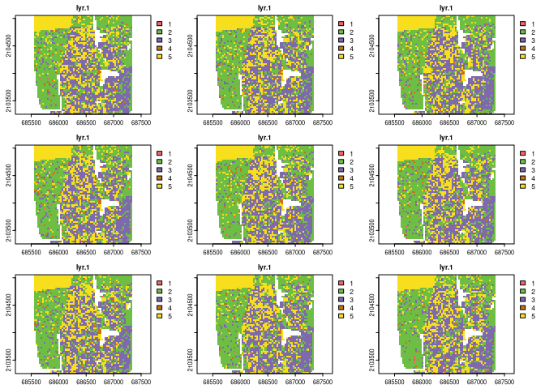

<!-- README.md is generated from README.Rmd. Please edit that file -->

# raceland

<!-- badges: start -->

[](https://github.com/Nowosad/raceland/actions)
[](https://app.codecov.io/gh/Nowosad/raceland?branch=master)
[](https://CRAN.R-project.org/package=raceland)
[](https://cran.r-project.org/package=raceland)
<!-- badges: end -->

The **raceland** package implements a computational framework for a
pattern-based, zoneless analysis, and visualization of (ethno)racial
topography (Dmowska et al., 2020). It is a reimagined approach for
analyzing residential segregation and racial diversity based on the
concept of ‘landscape’ used in the domain of landscape ecology. A racial
landscape, represented by a high-resolution raster grid with each cell
containing only inhabitants of a single race, is quantified by two
metrics (entropy and mutual information) derived from Information Theory
concept (IT). Entropy is the measure of racial diversity and mutual
information measures racial segregation.

Racial landscape method is based on the raster gridded data, and unlike
the previous methods, does not depend on the division of specific zones
(census tract, census block, etc.). Calculation of racial diversity
(entropy) and racial segregation (mutual information) can be performed
for the whole area of interests (i.e., metropolitan area) without
introducing any arbitrary divisions. Racial landscape method also allows
for performing calculations at different spatial scales.

## Installation

You can install the released version of raceland from
[CRAN](https://CRAN.R-project.org) with:

``` r
install.packages("raceland")
```

You can install the development version from
[GitHub](https://github.com/) with:

``` r
# install.packages("remotes")
remotes::install_github("Nowosad/raceland")
```

## Example

``` r
library(raceland)
library(terra)
#> terra 1.5.40
```

``` r
# Plot the input data
race_raster = rast(system.file("extdata/race_raster.tif", package = "raceland"))
plot(race_raster)
```


``` r
# Construct racial landscape
real_raster = create_realizations(x = race_raster, n = 100)
race_colors = c("#F16667", "#6EBE44", "#7E69AF", "#C77213","#F8DF1D")
plot(real_raster, col = race_colors, maxnl = 9)
```



``` r
# Plot racial ladnscape 
plot_realization(x = real_raster[[1]], y = race_raster, hex = race_colors)
```


``` r
# Calculate local subpopulation densities
dens_raster = create_densities(real_raster, race_raster, window_size = 10)
plot(dens_raster, maxnl = 9)
```


``` r
# Calculate IT-metrics 
metr_df = calculate_metrics(x = real_raster, w = dens_raster,
                            neighbourhood = 4, fun = "mean", 
                            size = NULL, threshold = 1)
head(metr_df)
#>   realization row col      ent  joinent  condent    mutinf
#> 1           1   1   1 1.634765 3.137711 1.502945 0.1318199
#> 2           2   1   1 1.633231 3.165357 1.532126 0.1011056
#> 3           3   1   1 1.639965 3.164693 1.524728 0.1152377
#> 4           4   1   1 1.649191 3.181056 1.531865 0.1173264
#> 5           5   1   1 1.640224 3.167782 1.527558 0.1126660
#> 6           6   1   1 1.634800 3.149787 1.514986 0.1198139
```

``` r
# Summarize IT metrics 
summary(metr_df[, c("ent", "mutinf")])
#>       ent            mutinf       
#>  Min.   :1.608   Min.   :0.09286  
#>  1st Qu.:1.629   1st Qu.:0.10838  
#>  Median :1.635   Median :0.11413  
#>  Mean   :1.635   Mean   :0.11429  
#>  3rd Qu.:1.640   3rd Qu.:0.11990  
#>  Max.   :1.656   Max.   :0.13964
```

## References

-   Dmowska, A., Stepinski T., Nowosad J. Racial landscapes – a
    pattern-based, zoneless method for analysis and visualization of
    racial topography. Applied Geography. 122:1-9,
    <http://dx.doi.org/10.1016/j.apgeog.2020.102239>

## Contribution

Contributions to this package are welcome. The preferred method of
contribution is through a GitHub pull request. Feel free to contact us
by creating [an issue](https://github.com/Nowosad/raceland/issues).
