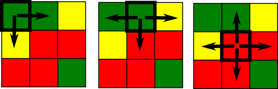

```{r, include = FALSE}
knitr::opts_chunk$set(
  collapse = TRUE,
  comment = "#>",
  fig.height = 5,
  fig.width = 6
)
```

# INTRODUCTION

The **raceland** package implements a computational framework for a pattern-based, zoneless analysis and visualization of (ethno)racial topography. 
It is a reimagined approach for analyzing residential segregation and racial diversity based on the concept of ‘landscape’ used in the domain of landscape ecology.

The proposed approach adopts a bird’s view perspective - in which visualization and quantification of racial topography (an overall organization of a spatial pattern formed by locations of people of different races) are tightly intertwined by using the same data - a high-resolution raster grid with each cell containing only inhabitants of a single race. Such grids represent __*a racial landscape (RL).*__
A *racial landscape (RL)*  consists of the mosaic of many large and small patches (racial enclaves) formed by adjacent raster grid cells having the same race categories. 
The distribution of racial enclaves creates a specific spatial pattern.

The racial landscape is described by *exposure matrix* and quantified by two metrics (entropy and mutual information) derived from Information Theory concept (IT).
Entropy is the measure of racial diversity and mutual information measures racial segregation. 

**Racial landscape method** is based on the raster gridded data, and unlike the previous methods, does not depend on the division for specific zones (census tract, census block, etc.).
Calculation of racial diversity (entropy) and racial segregation (mutual information) can be performed for the whole area of interests (i.e., metropolitan area) without introducing any arbitrary divisions. 
Racial landscape method also allows for performing the calculation at different spatial scales.

# A COMPUTATIONAL FRAMEWORK

A computational framework implemented in the **raceland** package allows for: 

1. Constructing racial landscape based on race-specific raster grids. 

2. Describing the racial pattern of a racial landscape at different scales or/and for the whole area of interests using metrics derived from Information Theory concept (entropy and mutual information). 

3. Mapping the racial landscape. 

4. Mapping racial diversity and segregation at different scales. 

The computational framework consists of the four steps (see figure below, the blue font indicates the names of function from the **raceland** package). 

```{r, echo=FALSE, out.width=800}
knitr::include_graphics("fig0framework.png")
```

## Required packages

The computational framework requires following packages: **raceland**, **comat**, **rgdal**, **raster**, **sf**, and **dplyr**. 

```{r, eval=FALSE}
# install required packages 
pkgs = c(
  "raceland",                
  "comat",            
  "rgdal",   
  "raster",
  "sf",              
  "dplyr"
)
to_install = !pkgs %in% installed.packages()
if(any(to_install)) {
  install.packages(pkgs[to_install])
}
```

```{r, warning=FALSE, message=FALSE, include=FALSE}
# attach required packages
library(raceland)
library(raster)
library(sf)
library(dplyr)
```

## Input data 

Racial landscape method is based on high-resolution race-specific raster grids.
Each cell in race-specific grids contains race subpopulation density. 
SocScape project provides high-resolution raster grids for 1990, 2000, 2010 years for 365 metropolitan areas and each county in the conterminous US. 
Data is available at http://www.socscape.edu.pl/index.php?id=high-resolution-grids/.

The calculation can also be performed using a spatial vector file (e.g., shapefile) with attribute table containing race counts for aggregated data. 
In such case, a spatial vector object is first rasterized using the `zones_to_rasters()` function from the **raceland** package (people of a given race are redistributed to the cells by dividing the number of people by the number of cells belonging to the particular spatial units).

Please notice that the rasterization time depends on the number of divisions and for large areas (i.e., metropolitan areas) can be time-consuming. 
It is recommended to use the smallest available divisions.

Here we demonstrate a computational framework using an example of the area of 60x60 cells. 
The input data is a high-resolution (30m) raster grids. 
Race-specific rasters are stored as GeoTIFFs (the directory contains five files for five race-groups: Asians, Blacks, Hispanic, others and Whites). 

The RasterStack with race-specific grids is created based on the GeoTIFF files (files will be sorted and read into RasterStack in alphabetical order; the categories in the racial landscape will depend on the order of layers in input data - see details in the next section).

### Working with high resolution grids

```{r}
list_raster = list.files(system.file("rast_data", package = "raceland"),
                         full.names = TRUE)
```

```{r}
race_raster = stack(list_raster)
race_raster
```

```{r fig1, fig.align = "center", out.width = '80%'}
plot(race_raster)
```

### Working with vector data

While using spatial vector data, the file should be read to R using the `st_read()` function from the **sf** package.
In the next step spatial object is rasterized using `zones_to_rasters()` from the **raceland** package. 

Function `zones_to_rasters()` requires three arguments: 

- `v` - an sf object with aggregated attribute data 
- `resolution` - a resolution of the output raster (below we use `resolution=30`, which is the same resolution as used in the SocScape grids)
- `variables` - a character vector with columns names from *v*. 
The values from these columns will be (1) rasterized and (2) recalculated to densities.
Each column will be represented as a layer in the output RasterStack. 

```{r}
pf_to_data = system.file("vect_data/block_data.gpkg", package = "raceland")
```

```{r, warning=FALSE, message=FALSE}
vect_data = st_read(pf_to_data)
```

```{r}
names(vect_data)
```

```{r, warning=FALSE, message=FALSE}
race_raster_from_vect = zones_to_raster(v = vect_data,
                                        resolution = 30, 
                                        variables = c("ASIAN", "BLACK", "HISPANIC", "OTHER", "WHITE"))
```

Once vector data is rasterized, there is no difference, whether race_raster object or race_raster_from_vect will be used for further analysis. 

## Constructing racial landscape 

The racial landscape is a high-resolution grid in which each cell contains only inhabitants of a single race.

The racial landscape is constructed based on race-specific grids.
Racial composition at each cell is translated to probabilities of drawing a person of a specific race from a cell. 
Thus, the race label of a cell is a random variable.
To obtain a stochastic realization of racial landscape, we use the cell's race probabilities and a random number generator to randomly assign specific race label to each cell (Monte Carlo procedure).

Multiple draws yield to a series of realization with a slightly different pattern (see example below). 
The pattern uncertainty occurs only at sub-block scale and only if there is significant sub-block racial diversity.

A single realization-based visualization is sufficiently accurate. 
For increased accuracy, racial topography is quantified as an ensemble average from multiple realizations.
It is recommended to calculate at least 30 realizations.

Realization is constructed using the `create_realizations()` function with two arguments:

- `x` - RasterStack with race-specific population densities assign to each cell
- `n` - A number of realizations to generate

Function returns *RasterStack* object containing *n* realizations.
Single race label in a racial landscape is assigned based on the order of race-specific grids stored in RasterStack.
For example, *race_raster* object has five layers named: asian, black, hispanic, other, white. 
The race labels in racial landscape raster will be 1 - asian, 2- black, 3 - hispanic, 4 - other, 5 - white. 

```{r}
# generate 100 realizations based on race_raster object
real_raster = create_realizations(x = race_raster, n = 100)
```


```{r, fig2, fig.align = "center", out.width = '100%'}
# plot five first realizations
plot(real_raster[[1:5]], col = c("#F16667", "#6EBE44", "#7E69AF", "#C77213", "#F8DF1D"))
```

The racial landscape provides a skewed visualization of the racial pattern because it does not take into consideration the spatial variability of the population densities. 
To obtain an accurate depiction of racial distribution, the values of RL must be modified to reflect race and subpopulation densities.

Function `plot_realization()` display realization taking into account also subpopulation density. 
The function takes three arguments:

- `x` - A raster object (RasterLayer, RasterStack, RasterBrick) with one selected realization representing a racial landscape
- `y` - RasterStack with race-specific population densities
- `hex` - A character vector with colors specified in hexadecimal format. 
Colors should correspond to categories in realization (racial landscape)

```{r, fig3, fig.align = "center", out.width = '40%'}
# In race_colors first color corresponds to asian, second to black,
# third to hispanics, fourth to other and fifth to white)
race_colors = c("#F16667", "#6EBE44", "#7E69AF", "#C77213", "#F8DF1D")
plot_realization(x = real_raster[[1]], y = race_raster, hex = race_colors)
```

## Describing racial patterns of racial landscape

The exposure matrix describes a racial pattern.
In the domain of landscape ecology, landscape pattern can be described by a co-occurrence matrix. 
The co-occurrence matrix is a tabulation of cells' adjacencies. 
Adjacencies between pairs of cells are defined by 4-connectivity rule (There are max. 4 adjacencies: north, east, south, and west cell as is shown in the figure below).

```{r, echo=FALSE, out.width = '100%'}

```

The co-occurrence matrix has the size K x K (K - number of categories), is symmetrical and can be calculated for any region regardless of its size or shape.

Exposure matrix is a modification of co-occurrence matrix. 
The exposure matrix is calculated in the same way as the co-occurrence matrix, but each adjacency contributes as a location-specific value to the matrix instead of the constant value 1. 
The contributed value is calculated as the average of local population densities in the two adjacent cells.

Let consider an example of the racial landscape presented below. 
The co-occurrence matrix is constructed using only adjacencies from the racial landscape.
To obtain an exposure matrix, each cell in the racial landscape has assigned two types of information: single race class and local population density. 
Considering two green adjacent cells - this pair will contribute 1 to the co-occurrence matrix (one adjacent pair) and the average from 2 and 1 ((2+1)/2)=1.5) to the exposure matrix. 

```{r, echo=FALSE, out.width = '100%'}
knitr::include_graphics("fig2matrix.png")
```

### Calculating local subpopulation densities

Local densities of subpopulations (race-specific local densities) along with racial landscapes are used to construct the exposure matrix.
Local densities are calculated using the `create_densities()` function, which requires three arguments:

- `x` - RasterStack with realizations
- `y` - RasterStack with shares of subpopulations (input data RasterStack)
- `window_size` - the size, expressed in the number of cells, of a square-shaped window for which local densities will be calculated; it is recommended to use the small window_size, i.e., 10 (`window_size=10` means that the local densities will be calculated from the area of 10 x 10 cells).

The output is a RasterStack with local densities calculated separately for each realization. 

```{r}
dens_raster = create_densities(real_raster, race_raster, window_size = 10)
```

### Exposure matrix

Here we show an example, how the exposure matrix is calculated.
Please notice, that the calculation of the exposure matrix is build-in into the `calculate_metrics()` function and there is no need to calculate exposure matrix separately. 

Exposure matrix can be calculated separately using the `get_wecoma()` function from the **comat** package. 
Calculation of exposure matrix requires two arguments: 

- `x` - RasterLayer with one selected realization 
- `y` - RasterLayer with local densities corresponding to selected realizations. 

As default, the exposure matrix with 4-directions adjacencies (`neighboorhood = 4`) is calculated using the average values from 2 adjacent cells (`fun = "mean"`). 

```{r}
exposure_mat = comat::get_wecoma(x = as.matrix(real_raster[[1]]), 
                                 w = as.matrix(dens_raster[[1]]))
colnames(exposure_mat) = c("ASIAN", "BLACK", "HISPANIC", "OTHER", "WHITE")
rownames(exposure_mat) = c("ASIAN", "BLACK", "HISPANIC", "OTHER", "WHITE")
round(exposure_mat, 2)
```

### Information theory metrics (IT metrics)

For lucid quantification of racial topography, further compression of the exposure matrix is required.
A racial pattern can be described (in the same way as landscape pattern in the domain of landscape ecology) by using Information Theory metrics - entropy and mutual information.
Entropy is associated with measuring racial diversity, and mutual information is associated with measuring racial segregation.

Information theory metrics are calculated using function `calculate_metrics()`. 
This function calculates the exposure matrix and summarizes it by calculating four IT-derived matrics: entropy (ent), joint entropy (joinent), conditional entropy (condent) and mutual information (mutinf). 
The function requires the following arguments:

- `x` - RasterStack with realizations
- `w` - RasterStack with local densities
- `neighboorhood` - adjacencies between cells can be defined in 4 directions (`neighboorhood = 4`) or 8 directions (`neighboorhood = 8`).
- `fun` - function to calculate values from adjacent cells to contribute to the exposure matrix, `fun = 'mean'` calculate average values of population density from two adjacent cells. Other available options are geometric mean (`'geometry_mean'`) or value from a focal cell (`'focal`')
- `size = NULL` - calculation will be performed for the whole area (see explanation later)
- `threshold` - the share of NA cells to allow metrics calculation.
`threshold = 1` - calculation will be performed, even if there are 100% cells with NA values (recommended with `size = NULL`)

```{r}
metr_df = calculate_metrics(x = real_raster, w = dens_raster, 
                            neighbourhood = 4, fun = "mean", 
                            size = NULL, threshold = 1)
```

```{r}
head(metr_df)
```

IT metrics are calculated for each realization separately, and in the next step, an average value from all realization is calculated.

```{r}
summary(metr_df[, c("ent", "mutinf")])
```

```{r}
metr_df %>% 
  summarise(mean_ent = mean(ent, na.rm = TRUE),
  sd_ent = sd(ent, na.rm = TRUE),
  mean_mutinf = mean(mutinf),
  sd_mutinf = sd(mutinf))
```
