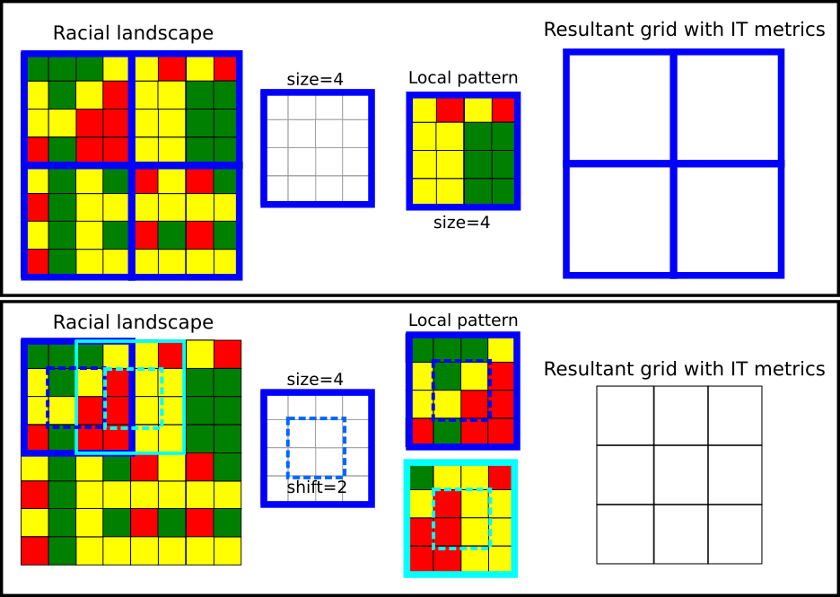
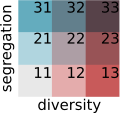

```{r, include = FALSE}
knitr::opts_chunk$set(
  collapse = TRUE,
  comment = "#>",
  fig.height = 5,
  fig.width = 6
)
```

# INTRODUCTION

The **raceland** package implements a computational framework for a pattern-based, zoneless analysis and visualization of (ethno)racial topography. 
It is a reimagined approach for analyzing residential segregation and racial diversity based on the concept of ‘landscape’ used in the domain of landscape ecology.
An overview of the implemented method is presented in the first vignette. 
Here we demonstrate, how the **raceland** package can be used for describing racial landscape at different spatial scales. 

**Racial landscape method** is based on the raster gridded data, and unlike the previous methods, does not depend on the division for specific zones (census tract, census block, etc.).
Calculation of racial diversity (entropy) and racial segregation (mutual information) can be performed for the whole area of interests (i.e., metropolitan area) without introducing any arbitrary divisions. 
Racial landscape method also allows for performing the calculation at different spatial scales.

```{r, eval=FALSE}
# install required packages 
pkgs = c(
  "raceland",                
  "comat",            
  "rgdal",   
  "raster",
  "sf",              
  "dplyr",
  "RColorBrewer"
)
to_install = !pkgs %in% installed.packages()
if(any(to_install)) {
  install.packages(pkgs[to_install])
}
```

```{r, warning=FALSE, message=FALSE, include=FALSE}
library(raceland)
library(raster)
library(sf)
library(dplyr)
```

A computational framework requires a few steps (see the first vignette for details) before calculating IT-metrics:

```{r}
# reading input data
list_raster = list.files(system.file("rast_data", package = "raceland"),
                         full.names = TRUE)
race_raster = stack(list_raster)

# constructing racial landscape
real_raster = create_realizations(x = race_raster, n = 100)

# calculating local subpopulation densities
dens_raster = create_densities(real_raster, race_raster, window_size = 10)
```


# DESCRIBING LOCAL RACIAL PATTERNS OF RACIAL LANDSCAPES AT DIFFERENT SPATIAL SCALES

## Defining local patterns

Let consider an example presented below. 
The racial landscape covers the area of 16 by 16 cells. 
Such an area can be divided into a square-shaped block of cells. 
Each square of cells will represent a local pattern (a local landscape), and for each local pattern, IT metrics (entropy and mutual information) are calculated.
The extent of a local pattern is defined by two parameters: *size* and *shift*.

- *Size* parameter, expressed in the numbers of cells, is a length of the side of a square-shaped block of cells. 
It defines the extent of a local pattern.
- *Shift* parameter defines the shift between adjacent squares of cells along with the N-S and W-E directions.
It describes the density (resolution) of the output grid.
The resolution of the output map will be reduced to the new resolution = original resolution x shift.
When:
    + shift == size - the input map will be divided into a grid of non-overlaping square windows. 
    Each square window defines the extent of a local pattern.

    + shift < size - results in the grid of overlapping square windows. 
    A local pattern is calculated from the square window defined by size parameter; the next square window is shifted (in N-S and W-E directions) by the number of cells defined by *shift* parameter.

The example presented below consists of the racial landscape 16 by 16 cells. 
Setting `size = 4` (and `shift= 4`) results in dividing the racial landscape into four squared windows, each 4x4 cells. 
Each window represents a local pattern. 
For each local pattern, IT metrics can be calculated, and the results will be assigned to the resultant grid of square windows.
In fact, the original racial landscape with 16x16 cells is reduced to the 2x2 'large cells'.

Setting `size=4` and `shift = 2` results in overlapping square windows. 
First, the window of the size 4x4 defines the local pattern (see dark blue square). 
In the next step, this window is shifted by two cells to the right, and the new local pattern is selected (see the light blue square). It will create a resultant grid of the cell size defined by the shift parameter.

```{r, echo=FALSE, out.width = '100%'}

```

## Calculate IT metrics from local patterns (1)

The `create_grid()` function creates spatial object with a grid (each 'cell' is defined by size and shift). 
This function requires the RasterStack object with realizations (racial landscapes) and size parameter. 
If the shift parameter is not set, it is assumed that `size=shift`. 
Below such grid is imposed into the racial landscape to show local patterns. 

```{r, fig5, fig.align = "center", out.width = '40%'}
race_colors = c("#F16667", "#6EBE44", "#7E69AF", "#C77213", "#F8DF1D")
grid_sf = create_grid(real_raster, size = 20)
plot_realization(real_raster[[1]], race_raster, hex = race_colors)
plot(st_geometry(grid_sf), add = TRUE, lwd = 2)
```

The `calculate_metrics()` function  is used to calculate IT metrics. 
Parameter `size=20` means that the area of interests will be divided into a grid of local patterns of the size 20x20 cells (which in this case corresponds to the square of 0.6 km x 0.6km). 
The `neighboorhood = 4` defines that adjacencies between cells are defined in four directions, `fun="mean"` calculate average values of population density from adjacent cells, `threshold = 0.5` - calculation will be performed if there is at least 50% of non-NA cells.

IT metrics are calculated for each local pattern for each realization.
The output table will have 900 rows (there are nine local patterns of size 20x20 cells and 100 realizations).

```{r}
metr_df_20 = calculate_metrics(x = real_raster, w = dens_raster, 
                               neighbourhood = 4, fun = "mean", 
                               size = 20, threshold = 0.5)
metr_df_20[metr_df_20$realization == 1, ]
```

Racial topography at the analyzed scale is quantified as an ensemble average from multiple realizations.
First, for each square window is calculated the average value of entropy and mutual information based on 100 realizations.
The table below shows the mean (`ent_mean`, `mutinf_mean`) and standard deviation (`ent_sd`, `mutinf_sd`) values for each square window.

```{r}
smr = metr_df_20 %>%
  group_by(row, col) %>%
  summarize(
    ent_mean = mean(ent, na.rm = TRUE),
    ent_sd = sd(ent, na.rm = TRUE),
    mutinf_mean = mean(mutinf, na.rm = TRUE),
    mutinf_sd = sd(mutinf, na.rm = TRUE)
  )
smr
```

Then the averages from the mean values of entropy and mutual information are calculated. 

```{r}
smr %>% 
  ungroup() %>% 
  select(-row, -col) %>% 
  summarise_all(mean)
```

### Racial diversity-segregation classification

Racial diversity and segregation can be analyzed and displayed separately. 
However, much more information can be gained by visualizing those two measures at the same time. 
For this purpose, entropy and mutual information are reclassified into three classes (1-low, 2-medium, 3-high).
By joining those two classification, we obtain 9 classes, each describing the level of diversity and segregation: 11 - low segregation/low diversity; 12-low segregation/medium diversity; 13-low segregation/high diversity; 21 - medium segregation/low diversity; 22-medium segregation/medium diversity; 23-medium segregation/high diversity; 31 - high segregation/low diversity; 32-high segregation/medium diversity; 33-high segregation/high diversity.

Each class is coded by one color using bivariate palette (see below). 

```{r, echo=FALSE, out.width = '40%'}

```

The `bivariate_classification()` function presented below takes three arguments (`entropy` - a vector of entropy values, `mutual_information` - a vector of mutual information values, `n` - a number of categories in racial landscape) and return a 9-coded vector of racial segregation/divesity classes. 

```{r}
# n is a number of categories in racial landscape
bivariate_classification = function(entropy, mutual_information, n) {
  
  # calculate bivariate classification
  nent = log2(n)
  ent_cat = cut(entropy, breaks = c(0, 0.66, 1.33, nent), labels = c(1, 2, 3), 
                include.lowest = TRUE, right = TRUE)
  ent_cat = as.integer(as.character(ent_cat))
  
  mut_cat = cut(mutual_information, breaks = c(0, 0.33, 0.66, 1), labels = c(10, 20, 30), 
                include.lowest = TRUE, right = TRUE)
  mut_cat = as.integer(as.character(mut_cat))
  
  bivar_cls = mut_cat + ent_cat
  bivar_cls = as.factor(bivar_cls)
  
  return(bivar_cls)
}
```

```{r}
smr$bivar_cls = bivariate_classification(entropy = smr$ent_mean, 
                                         mutual_information = smr$mutinf_mean,
                                         n = nlayers(race_raster))
```

### Mapping local racial diversity and racial segregation 

The average value of entropy and mutual information calculated for each square-shaped window from all realizations can be joined to the spatial grid object.
Such operation allows for mapping metrics and shows how segregation and racial diversity change over the area. 

```{r}
# join IT-metric to the grid
attr_grid = dplyr::left_join(grid_sf, smr, by = c("row", "col"))
```

```{r}
# calculate breaks parameter for plotting entropy and mutual information
# the values of entropy and mutual information are divided into equal breaks
ent_breaks = c(seq(0, 2, by = 0.25), log2(nlayers(race_raster)))
mut_breaks = seq(0, 1, by = 0.1)
```

### Mapping racial diversity 

```{r, warning=FALSE, message=FALSE, fig.align = "center"}
plot(attr_grid["ent_mean"], breaks = ent_breaks, key.pos = 1, 
     pal = rev(RColorBrewer::brewer.pal(length(ent_breaks) - 1, name = "RdBu")),
     # pal = grDevices::hcl.colors(length(ent_breaks) - 1, palette = "Blue-Red"),
     bty = "n", main = "Racial diversity (Entropy)")
```

### Mapping racial segregation

```{r, warning=FALSE, message=FALSE, fig.align = "center"}
plot(attr_grid["mutinf_mean"], breaks = mut_breaks, key.pos = 1, 
     pal = rev(RColorBrewer::brewer.pal(length(mut_breaks) - 1, name = "RdBu")),
     # pal = grDevices::hcl.colors(length(mut_breaks) - 1, palette = "Blue-Red"),
     bty = "n", main = "Racial segregation (Mutual information)")
```

### Mapping racial segregation and diversity using bivariate classification

```{r, fig.align = "center"}
biv_colors = c("11" = "#e8e8e8", "12" = "#e4acac", "13" = "#c85a5a", "21" = "#b0d5df",
               "22" = "#ad9ea5", "23" = "#985356", "31" = "#64acbe", "32"= "#627f8c", 
               "33" = "#574249")
bcat = biv_colors[names(biv_colors)%in%unique(attr_grid$bivar_cls)]
plot(attr_grid["bivar_cls"], pal = bcat, main = "Racial diversity and residential segregation")
```

### Calculate IT metrics from local patterns (overlapping windows)

The next example shows how to calculate a local pattern using overlapping windows. 
This option is recommended to use, especially for a larger size value. Using overlapping windows does not introduce arbitrary boundaries.

To obtain overlapping windows the `calculate_metrics()` function requires additional argument - `shift`. 

```{r}
# calculate metrics for overlapping windows
metr_df_10 = calculate_metrics(x = real_raster, w = dens_raster, 
                               neighbourhood = 4, fun = "mean", 
                               size = 20, shift = 10, threshold = 0.5)

smr10 = metr_df_10 %>%
  group_by(row, col) %>%
  summarize(
    ent_mean = mean(ent, na.rm = TRUE),
    ent_sd = sd(ent, na.rm = TRUE),
    mutinf_mean = mean(mutinf, na.rm = TRUE),
    mutinf_sd = sd(mutinf, na.rm = TRUE)
  )

smr10 %>% 
  ungroup() %>% 
  select(-row, -col) %>% 
  summarise_all(mean)

# calculate bivariate classification
smr10$bivar_cls = bivariate_classification(
  entropy = smr10$ent_mean,
  mutual_information = smr10$mutinf_mean,
  n = nlayers(race_raster)
)
```

## Mapping local racial diversity and racial segregation 

The average value of entropy and mutual information calculated for each square-shaped window from all realizations can be joined to spatial grid object (created by `create_grid()`). 
For overlapping windows, the resolution of the grid will be defined by *shift* parameter.

```{r}
# create spatial grid object
grid_sf10 = create_grid(real_raster, size = 20, shift = 10)

# join IT-metrics to the grid
attr_grid10 = dplyr::left_join(grid_sf10, smr10, by = c("row", "col"))
```

### Mapping racial diversity 

```{r, warning=FALSE, message=FALSE, fig.align = "center"}
plot(attr_grid10["ent_mean"], breaks = ent_breaks, key.pos = 1, 
     pal = rev(RColorBrewer::brewer.pal(length(ent_breaks) - 1, name = "RdBu")),
     # pal = grDevices::hcl.colors(length(ent_breaks) - 1, palette = "Blue-Red"),
     bty = "n", main = "Racial diversity (Entropy)")
```

### Mapping racial segregation

```{r, warning=FALSE, message=FALSE, fig.align = "center"}
plot(attr_grid10["mutinf_mean"], breaks = mut_breaks, key.pos = 1,
     pal = rev(RColorBrewer::brewer.pal(length(mut_breaks) - 1, name = "RdBu")),
     # pal = grDevices::hcl.colors(length(mut_breaks) - 1, palette = "Blue-Red"),
     bty = "n", main = "Racial segregation (Mutual information)")
```

### Mapping racial segregation and diversity using bivariate classification

```{r, fig.align = "center"}
# `biv_color`s defines a bivariate palette, 
# `bcat` selects only colors for categories available for analyzed areas
biv_colors = c("11" = "#e8e8e8", "12" = "#e4acac", "13" = "#c85a5a", "21" = "#b0d5df", 
               "22" = "#ad9ea5", "23" = "#985356", "31" = "#64acbe","32" = "#627f8c",
               "33" = "#574249")
bcat = biv_colors[names(biv_colors)%in%unique(attr_grid10$bivar_cls)]
plot(attr_grid10["bivar_cls"], pal = bcat, main = "Racial diversity and residential segregation")
```
