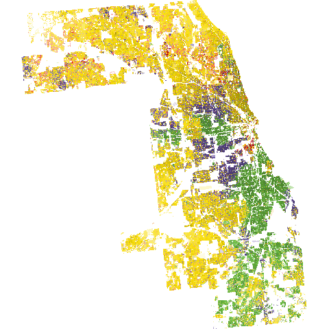
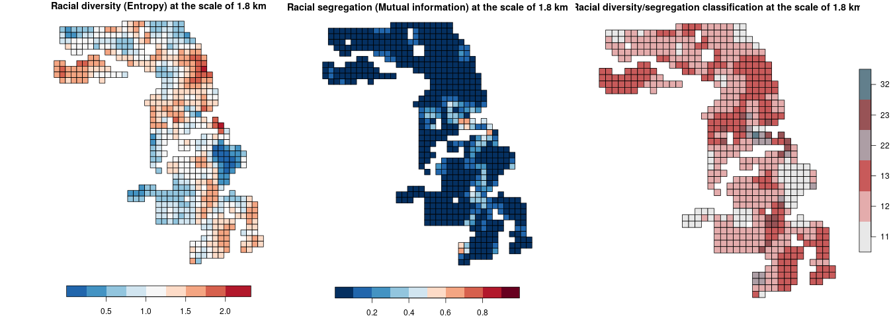

```{r, include = FALSE}
knitr::opts_chunk$set(
  collapse = TRUE,
  comment = "#>",
  fig.height = 5,
  fig.width = 6
)
```

# INTRODUCTION

The **raceland** package implements a computational framework for a pattern-based, zoneless analysis and visualization of (ethno)racial topography. 
It is a reimagined approach for analyzing residential segregation and racial diversity based on the concept of ‘landscape’ used in the domain of landscape ecology.
An overview of the implemented method is presented in the first vignette. 
Here we demonstrate, how the **raceland** package can be used for describing racial landscape at different spatial scales. 

Here we demonstrate, how to use the implemented method with SocScape race-specific grids to perform analysis for different spatial scales.
We use Cook county data as an example.

# INPUT DATA

SocScape project provides a high resolution (30m) grids for each county in the conterminous U.S. and 351 MSA for 1990, 2000 and 2010. 
Data are organized as zip archives with three directories: 

1. **population** - contains population grids for each year (4 grids)
2. **diversity** - contains racial diversity classification grids for each year (4 grids)
3. **race** - contains separate grids for seven race/ethnicity groups for each year (27 grids)

These grids have been calculated from the U.S. Census block-level data using dasymetric modeling with land cover as an auxiliary variable.
Data is available at http://www.socscape.edu.pl/index.php?id=high-resolution-grids/. 

# A COMPUTATIONAL FRAMEWORK 

A few steps are required to perform analysis based on the SocScape grids:

1. **Download data**: to download data, go to the website http://www.socscape.edu.pl/index.php?id=high-resolution-grids/.
For example, select state: Illinois; select county: Cook.
The *il_cook.zip* file will be downloaded. 

2. **Unzip the archive** with the high-resolution grids. 

3. **Use presented below script to fully automate analysis**. 
The script requires to define a few arguments (see example below): 

    - a path to working directory
    - a path to *race* directory in unzipped data. 
    - sfx - defines what datasets will be used('1990myc' - a hi-res grids for 1990; '2000myc' - a hi-res grids for 2000; '2010myc' - a hi-res grids for 2010)
    - number of realization to calulate (i.e `nrealization = 100`)
    - size and shift arguments use to calculate IT-metrics for different spatial scale.
    It is a list of vectors in which the first element of the vector defines the size and the second the shift. 

# RESULTS

Script creates a *results* directory with four subdirectories:

- **final** - contains final results:

    + complete_smr.csv -  files with entropy and mutual information for different spatial scales
    + figures with maps for different scales: racial segregation (segregation_[size]_[shift].png), racial diversity (diversity_[size]_[shift].png) and segregation/diversity classification (bivar_[size]_[shift].png)
    
- **out_data** - contains three files in the *.rds format:
    
     + race_raster.rds - RasterStack with race-specific grids read from GeoTiffs files
     + real_rast.rds - RasterStack with realizations
     + dens_rast.rds - RasterStack with local densities
     
- **out_metrics** - IT-metrics calculated for each defined spatial scale 

- **shp** - contains shapefiles with attribute tables for each defined spatial scale. 
Shapefiles can be used to prepare maps

```{r, echo = FALSE}
df = data.frame(size = c("60", "120", "240", "480", "ALL"),
                shift = c("30", "60", "120", "240", "ALL"),
                n = c(2245,584,145,37,1),
                ent = c(1.0468, 1.1331, 1.2951, 1.4403, 1.8393),
                ent_sd = c(0.0166, 0.0087, 0.0043, 0.0023, 0.0006),
                mutinf = c(0.0422, 0.0759, 0.1432, 0.2229, 0.4732),
                mutinf_sd = c(0.0051, 0.0036, 0.0027, 0.0019, 0.0009))
knitr::kable(df, caption = "Table 1: Entropy and mutual information for different spatial scales")
```

```{r, echo=FALSE, out.width = '40%', fig.cap="Figure 1: Racial landscape"}

```

```{r, echo=FALSE, out.width = '100%', fig.cap="Figure 2: Racial diversity and segregation at different spatial scales (an example for the scale of 1.8 km)"}

```

# SCRIPT TO CALCULATE THE IT-DERIVED METRICS FOR DIFFERENT SPATIAL SCALES

*Note: This calculation could take several minutes for larger counties.*

```{r, eval=FALSE}
# R script calculates IT-derived metrices for different spatial scales. 

# INSTALL REQUIRED PACKAGES 
pkgs = c(
  "raceland",                
  "comat",            
  "rgdal",   
  "raster",
  "sf",              
  "dplyr",
  "RColorBrewer"
)
to_install = !pkgs %in% installed.packages()
if(any(to_install)) {
  install.packages(pkgs[to_install])
}

# REQUIRED R-PACKAGES
library(raceland)
library(raster)
library(sf)
library(dplyr)
library(RColorBrewer)

# SET WORKING DIRECTORY
## setwd("")

################################## USER DEFINED PARAMETERS #######################################
# Please define following parameters before running a script. 

# Path to race directory with downloaded data.
pf_to_data = "il_cook/race"

# sfx indicates which dataset will be used. There are 3 options: 
## sfx="1990myc" - race specific grids for 1990 year.
## sfx="2000myc" - race specific grids for 2000 year.
## sfx="2010myc" - race specific grids for 2010 year.

sfx = "2010myc"

# Number of realizations (racial landscape) to generate.
# It is recommended to generate at least 30 realizations. 
nrealization = 100

# list with size and shift parameters: list(c(size, shift), c(size, shift),...). 
# In this case calculation will be performed for 4 different spatia scale:
# 1. c(60,30) - size = 60 local ladnscape from 60x60 cells window will be calculated, 
#    it corresponds to the spatial scale of 1.8km (60 cells x 30m).
# 2. c(120,60) - corresponds to the scale of 3.6 km. 
# 3. c(240,120) - corresponds to the scale of 7.2 km. 
# 4. c(480, 240) - corresponds to the scale of 14.4 km. 
list_size_shift = list(c(60,30), c(120,60), c(240,120), c(480, 240))

####################################################################################################

# FUNCTION TO CALCULATE RACIAL SEGREGATION/DIVERSITY CLASSIFICATION
bivariate_classification = function(entropy, mutual_information, n) {
  
  # max entropy is calculated as log2 from the number of race categories
  nent = log2(n)
  
  # divide entropy values into 3 categories
  ent_cat = cut(entropy, breaks = c(0, 0.66, 1.33, nent), labels = c(1, 2, 3), 
                include.lowest = TRUE, right = TRUE)
  ent_cat = as.integer(as.character(ent_cat))
  
  # divide mutual information values into 3 categories
  mut_cat = cut(mutual_information, breaks = c(0, 0.33, 0.66, 1), labels = c(10, 20, 30), 
                include.lowest = TRUE, right = TRUE)
  mut_cat = as.integer(as.character(mut_cat))
  
  # combine categories of entropy (measure of racial diversity) 
  # and mutual information (measure of racial segregation) 
  bivar_cls = mut_cat + ent_cat
  bivar_cls = as.factor(bivar_cls)
  
  return(bivar_cls)
}

####################################################################################################

# COLORS USED FOR VISUALIZATION
## They corresponds to 5 racial categories: ASIAN, BLACK, HISPANIC, OTHER, WHITE
race_colors = c("#F16667", "#6EBE44", "#7E69AF", "#C77213", "#F8DF1D")

## Bivariate palette to display the racial segregation/diversity classification
bivariate_class_colors = c("11" = "#e8e8e8", "12" = "#e4acac", "13" = "#c85a5a",
                           "21" = "#b0d5df", "22" = "#ad9ea5", "23" = "#985356",
                           "31" = "#64acbe", "32" = "#627f8c", "33" = "#574249")

####################################################################################################

################################## CREATE RESULTS DIRECTORY WITH SUBDIRECTORIES ####################
# results directory will be created as subdirectory in working directory
pf = getwd()
dir.create(file.path(pf, "results"), showWarnings = FALSE)
dir.create(file.path(pf, "results", "out_data"), showWarnings = FALSE)
dir.create(file.path(pf, "results", "out_metrics"), showWarnings = FALSE)
dir.create(file.path(pf, "results", "final"), showWarnings = FALSE)
dir.create(file.path(pf, "results", "shp"), showWarnings = FALSE)

###################################################################################################

################################## PREPROCESS RACE-SPECIFIC DATA ##################################
# Read data from GeoTIFFs to a RasterStack object
list_raster = list.files(pf_to_data, pattern = sfx, full.names = TRUE)
race_raster = stack(list_raster)

# Rename raster layers
rnames = sapply(strsplit(names(race_raster), "_"), tail, 1)
rnames = substr(rnames, 1, nchar(rnames) - nchar(sfx))

new_names = dplyr::recode(
  rnames,
  "hispanic" = "hispanic",
  "nham" = "am",
  "nhas" = "asian",
  "nhb" = "black",
  "nhother" = "other",
  "nhpi" = "pi",
  "nhw" = "white"
)
names(race_raster) = new_names

# Reorder layers in RasterStack
race_raster = subset(race_raster, c("asian", "am", "black", "hispanic", "other", "pi", "white"))

# Combine race-specific categories (ASIAN=ASIAN+PI, OTHER=OTHER+AM). 
# Please notice that pi category does not exist for 1990myc dataset.
if (sfx == "1990myc") {
  race_raster[["other"]] = race_raster[["other"]] + race_raster[["am"]]
  race_raster = dropLayer(race_raster, c("am"))
} else {
  race_raster[["other"]] = race_raster[["other"]] + race_raster[["am"]]
  race_raster[["asian"]] = race_raster[["asian"]] + race_raster[["pi"]]
  race_raster = dropLayer(race_raster, c("am", "pi"))
}

# race raster object contains 5 layers: 
# asian, black, hispanic, other, white with subpolulation densities
race_raster

# save race_raster to a rds file
saveRDS(race_raster, file.path(pf, "results", "out_data", "race_raster.rds"))

###################################################################################################

################################## CONSTRUCTING RACIAL LANDSCAPE ##################################
real_raster = create_realizations(race_raster, n = nrealization)

# save real_raster object
saveRDS(real_raster, file.path(pf, "results", "out_data", "real_rast.rds"))

# plot racial landscape
png(file.path("results", "final", "racial_landscape.png")) 
plot_realization(x = real_raster[[1]], y = race_raster, hex = race_colors)
dev.off() 
###################################################################################################

################################## CALCULATE RACE-SPECIFIC DENSTITIES #############################
dens_raster = create_densities(real_raster, race_raster, window_size = 10)

# save dens_raster object
saveRDS(dens_raster, file.path(pf, "results", "out_data", "dens_rast.rds"))
###################################################################################################

################################## CALCULATE METRICS FOR DIFFERENT SPATIAL SCALES ################

complete_smr_df = data.frame()
for (i in list_size_shift) { #start size loop
  size = i[1]
  shift = i[2]
  
  #######################CALCULATE METRICS FOR SPECIFIED SIZE/SHIFT PARAMETER######################
  metr_df = calculate_metrics(real_raster, dens_raster,
                              neighbourhood = 4, fun = "mean",
                              size = size, shift = shift, threshold = 0.5)
  
  # Summarize metrics
  ## Number of motifels at given spatial scale
  sel = metr_df[!is.na(metr_df$ent), ]
  nmotif = mean(table(sel$realization))
  
  # Metrics summary
  smr = metr_df %>%
    group_by(row, col) %>%
    summarize(
      ent_mean = mean(ent, na.rm = TRUE),
      ent_sd = sd(ent, na.rm = TRUE),
      mutinf_mean = mean(mutinf, na.rm = TRUE),
      mutinf_sd = sd(mutinf, na.rm = TRUE)
    )
  
  smr = as.data.frame(smr)

  # Calculate an ensemble average for entropy and mutual information
  complete_smr = c(
    size = size,
    shift = shift,
    n = nmotif,
    ent = mean(smr$ent_mean, na.rm = TRUE),
    ent_sd = mean(smr$ent_sd, na.rm = TRUE),
    mutinf = mean(smr$mutinf_mean, na.rm = TRUE),
    mutinf_sd = mean(smr$mutinf_sd, na.rm = TRUE)
  )
  complete_smr_df = rbind(complete_smr_df, complete_smr)
  
  # Calculate racial segregation/diversity classification
  smr$bivar_cls = bivariate_classification(entropy = smr$ent_mean, 
                                           mutual_information = smr$mutinf_mean,
                                           n = nlayers(race_raster))
  
  # Save the metrics to csv
  write.csv(metr_df, 
            file.path("results", "out_metrics",
                      paste("metr_df_", size, "_", shift, ".csv", sep = "")),
            row.names = FALSE)
  write.csv(smr, 
            file.path("results", "out_metrics", 
                      paste("smr_metr_df_", size, "_", shift, ".csv", sep = "")),
            row.names = FALSE)
  
  
  #######################CREATE SPATIAL OBJECT WITG METRICES######################
  
  # Create spatial object
  grid_sf = create_grid(real_raster, size = size, shift = shift)
  
  # Join metrics to the grid
  attr_grid = dplyr::left_join(grid_sf, smr, by = c("row", "col"))
  sel_grid = attr_grid[!is.na(attr_grid$ent_mean),]
  
  # Save the grid as shapefile
  st_write(attr_grid, 
           file.path("results", "shp", 
                     paste("metr_stat_", size, "_", shift, ".shp", sep = "")))
  
  #######################VISUALIZATION#########################################
  
  # Divide entropy values into 10 class
  ent_breaks = c(seq(0, 2, by = 0.25), log2(nlayers(race_raster)))
  
  # Divide mutual information into 10 class
  mut_breaks = seq(0, 1, by = 0.1)
  
  # Spatial scale in km
  scale_km = (shift * res(race_raster)[1]) / 1000
  
  # Mapping racial diversity (save plot to .png)
  png(file.path("results", "final", paste("diversity_", size, "_", shift, ".png", sep = ""))) 
  plot(sel_grid["ent_mean"], breaks = ent_breaks, key.pos = 1,
       pal = rev(brewer.pal(length(ent_breaks) - 1, name = "RdBu")), bty = "n", 
       main = paste("Racial diversity (Entropy) at the scale of ", 
                    scale_km, " km", sep = ""))
  dev.off() 
  
  # Mapping racial segregation (save plot to .png)
  png(file.path("results", "final", paste("segregation_", size, "_", shift, ".png", sep = ""))) 
  plot(sel_grid["mutinf_mean"], breaks = mut_breaks, key.pos = 1, 
       pal = rev(brewer.pal(length(mut_breaks) - 1, name = "RdBu")), bty = "n", 
       main = paste("Racial segregation (Mutual information) at the scale of ",
                    scale_km, " km", sep = ""))
  dev.off() 
  
  # Mapping racial segregation/diversity (save plot to .png)
  png(file.path("results", "final", paste("bivar_", size, "_", shift, ".png", sep = "")))   
  bcat = bivariate_class_colors[names(bivariate_class_colors)%in%unique(sel_grid$bivar_cls)]
  plot(sel_grid["bivar_cls"], 
       pal = bcat,
       main = paste("Racial diversity/segregation classification at the scale of ",
                     scale_km, " km", sep = ""))
  dev.off() 
} #stop size loop


###################################################################################################

################################## CALCULATE METRICS FOR THE WHOLE RACIAL LANDSCAPE ###############

metr = calculate_metrics(real_raster, dens_raster,
                         neighbourhood = 4, fun = "mean", 
                         size = NULL, threshold = 1)
complete_smr_all = c(
  size = "ALL",
  shift = "ALL",
  n = 1,
  ent = mean(metr$ent, na.rm = TRUE),
  ent_sd = sd(metr$ent, na.rm = TRUE),
  mutinf = mean(metr$mutinf, na.rm = TRUE),
  mutinf_sd = sd(metr$mutinf, na.rm = TRUE)
)
complete_smr_df = rbind(complete_smr_df, complete_smr_all)
colnames(complete_smr_df) = c("size", "shift", "n", "ent", "ent_sd", "mutinf", "mutinf_sd")

# Write table with metrices for different spatial scales and for the whole area. 
write.csv(complete_smr_df,
          file.path("results", "final", "complete_smr.csv"),
          row.names = FALSE)

###################################################################################################

```
